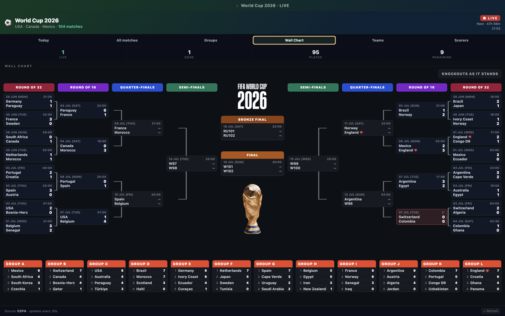

# World Cup 2026 Live Scores

A desktop scoreboard and tournament wall chart for the FIFA World Cup 2026, built with Electron.



## Features

- Live match status, scores, and tournament progress from ESPN data.
- Tabs for today's matches, the full schedule, groups, wall chart, teams, and top scorers.
- Knockout wall chart with projected round-of-32 matchups and group tables.
- Favourite team highlighting for quick scanning.
- Built as a compact macOS desktop app with a native Electron shell.

## Getting Started

Install dependencies:

```sh
npm install
```

Run the app locally:

```sh
npm start
```

Build the macOS app:

```sh
npm run build
```

## Project Structure

- `main.js` - Electron main process, app window, menu, and IPC helpers.
- `preload.js` - Safe browser-to-Electron bridge.
- `index.html` - App UI, styles, and scoreboard logic.
- `Screenshot1.png` - GitHub README artwork.

## Data

Match data is loaded from ESPN's public soccer endpoints and refreshed in the app. Highlights are loaded from YouTube RSS feeds where available.

## License

MIT
